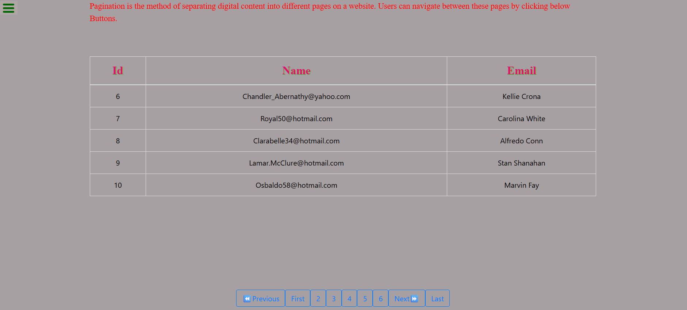

# 📑 Pagination

A simple web project that demonstrates **Pagination using DOM Manipulation** and Bootstrap styling.  
It fetches data from a public JSON source and displays it in a paginated table with navigation buttons.

---

## ✨ Features
- Fetches and displays data dynamically from a JSON API.
- User-friendly pagination with buttons:
  - `First`, `Previous`, `Next`, `Last` navigation
  - Page numbers (1–6)
- Responsive table with Bootstrap.
- Styled UI with custom CSS.
- Error handling for edge cases (e.g., already on first/last page).

---

## 📂 Project Structure
pagination/
│── index.html # Main HTML file
│── css/
│ └── style.css # Custom styles
│── js/
│ └── script.js # DOM Manipulation & Pagination Logic.

---


## 🔽 Clone the Repository
```bash
git clone https://github.com/Elanthiran/pagination.git
cd pagination
```
---

## ▶️ Usage

1. Open index.html in any modern browser.

2. The data will automatically load from the API.

3. Use pagination buttons to navigate between pages.

---

## 📸 Screenshots

Pagination UI :



---


🛠 Tech Stack

- HTML5 – Structure

- CSS3 – Styling

- JavaScript (Vanilla JS) – DOM manipulation & logic

- Bootstrap  – Responsive design

  ---

  ## 🚀 Future Improvements

- Add dynamic page number rendering (instead of hardcoded buttons).

- Add search/filter functionality.

- Support for more records and custom rows per page.


## 🤝 Contributing

Contributions, issues, and feature requests are welcome!
Feel free to fork this repo and submit a pull request.

-  Fork & clone repo


- Create a feature branch


- Commit changes


- Push branch

---

## 📜 License

This project is licensed under the MIT License – feel free to use it for learning and projects.


